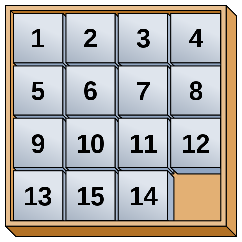
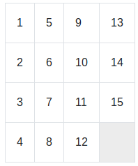

# Fifteen
The game of 15, tags, is a popular puzzle game invented in 1878 by Noah Chapman.  
  
[](https://github.com/yigres/fifteen/actions/workflows/main.yml)
[](https://codeclimate.com/github/yigres/fifteen/maintainability)
### Installation  
```sh
$ git clone git@github.com:yigres/fifteen.git
$ cd fifteen
$ make install
```  
### Usage
```sh
$ npm start
```  
### Play
Move:
* ArroLeft
* ArrowUp
* ArrowRight
* ArrowDown  
  
Only do it!!!  
  
  

[Go to fifteen](https://fifteen-mu.vercel.app/)
