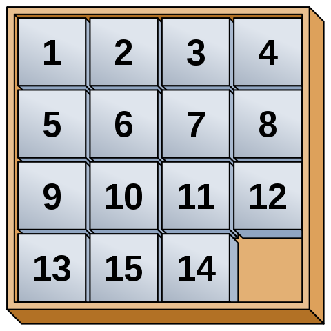

# Fifteen
The game of 15, tags, is a popular puzzle game invented in 1878 by Noah Chapman.  
  
### Installation  
```sh
$ git clone git@github.com:yigres/fifteen.git
$ cd fifteen
$ make install
```  
### Usage
```sh
$ npm start
```  
